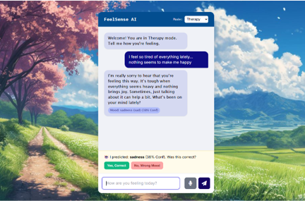
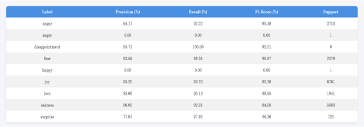
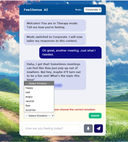

# 🌟 FeelSense: Emotion-Driven Conversational AI

> An intelligent chatbot that understands user emotions and responds with empathy using Machine Learning.

---

## 📌 Overview

FeelSense is an emotion-aware conversational AI system that detects user feelings from text and generates appropriate responses. It enhances chatbot interaction by making it more human-like, empathetic, and intelligent.

---

## 🎯 Key Features

- 🧠 Emotion Detection (Happy, Sad, Angry, Fear, Surprise, Neutral)
- 💬 Context-aware empathetic replies
- 🔁 Feedback-based learning system
- 📊 Model performance dashboard
- 🌐 Interactive web interface

---

## 🏗️ System Flow

```
User Input (Text)
        ↓
Preprocessing (Cleaning + TF-IDF)
        ↓
ML Model (SGD Classifier)
        ↓
Emotion Prediction
        ↓
Response Generation (LLM)
        ↓
Feedback Collection
        ↓
Dataset Update
```

---

## 🧪 Technologies Used

### 🔹 Backend
- Python
- Flask
- scikit-learn
- Pandas, NumPy
- Joblib

### 🔹 Frontend
- HTML5
- CSS
- JavaScript

### 🔹 AI / ML
- TF-IDF Vectorization  
- SGD Classifier  
- OpenAI API  

---

## 📸 Screenshots

### 🖥️ Chat Interface


### 📊 Metrics Dashboard


### 📊 Additional Metrics View


### 🧠 Emotion Prediction


---

## 📂 Project Structure

```
FeelSense/
│── app.py
│── model_utils.py
│── train_and_deploy.py
│── requirements.txt
│
├── static/
├── templates/
├── screenshots/
```

---

## ⚙️ Installation & Setup

```bash
git clone https://github.com/shraddhashivakumar/FeelSense.git
cd FeelSense
pip install -r requirements.txt
```

Create `.env` file:
```
OPENAI_API_KEY=your_api_key_here
```

Run app:
```bash
python app.py
```

Open browser:
```
http://localhost:5000
```

---

## 📊 Model Details

- Algorithm: **SGD Classifier**
- Feature Extraction: **TF-IDF**
- Dataset: `emotion.csv`

---

## 🚀 Applications

- 🧠 Mental Health Support  
- 🎓 Student Assistance  
- 🏢 Workplace Sentiment Analysis  
- 💬 Customer Support  

---

## 🔮 Future Work

- 🎤 Speech Emotion Recognition  
- 🌍 Multilingual Support  
- 🤖 Deep Learning Models (BERT, LSTM)  

---

## ⭐ Support

If you like this project, give it a ⭐ on GitHub!
